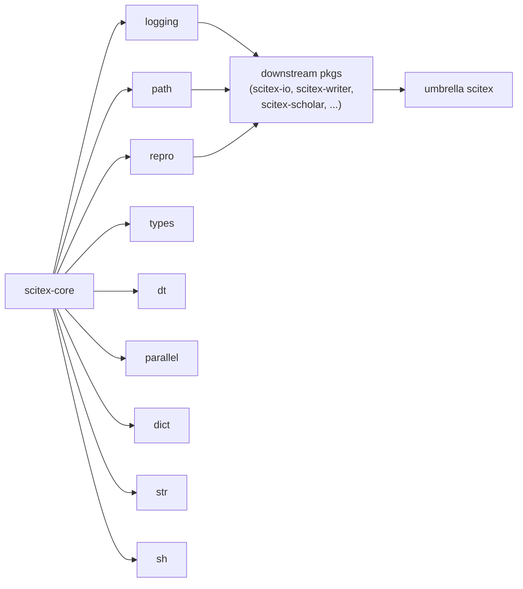

# scitex-core

<p align="center">
  <a href="https://scitex.ai">
    
  </a>
</p>

<p align="center"><b>Bundled foundation utilities (logging, errors, sh, path, str, dict, types, dt, parallel, repro) for the SciTeX ecosystem.</b></p>

<p align="center">
  <a href="https://scitex-core.readthedocs.io/">Full Documentation</a> · <code>pip install scitex-core</code>
</p>

<!-- scitex-badges:start -->
<p align="center">
  <a href="https://pypi.org/project/scitex-core/"></a>
  <a href="https://pypi.org/project/scitex-core/"></a>
  <a href="https://github.com/ywatanabe1989/scitex-core/actions/workflows/test.yml"></a>
  <a href="https://github.com/ywatanabe1989/scitex-core/actions/workflows/install-test.yml"></a>
  <a href="https://codecov.io/gh/ywatanabe1989/scitex-core"></a>
  <a href="https://scitex-core.readthedocs.io/en/latest/"></a>
  <a href="https://www.gnu.org/licenses/agpl-3.0"></a>
</p>
<!-- scitex-badges:end -->

---

## Problem and Solution

| # | Problem | Solution |
|---|---------|----------|
| 1 | **10 separate scitex-* utility packages for dev tooling** — `pip install scitex-str`, `scitex-dict`, `scitex-path`, ... gets tedious | **Bundled foundation** — `import scitex_core` exposes `logging`, `errors`, `sh`, `path`, `str`, `dict`, `types`, `dt`, `parallel`, `repro` in one install |

## Installation

```bash
pip install scitex-core
```

## Architecture

```
scitex_core/
├── __init__.py        ← re-exports every subpackage below
├── errors.py          ← shared exception hierarchy
├── logging/           ← getLogger(), .success(), file+console handlers
├── path/              ← find_git_root, find_file, this_path, mk_spath
├── repro/             ← RandomStateManager, gen_id, fix_seeds
├── sh/                ← shell-out helpers (sh, run, capture)
├── str/               ← printc, color_text, search-and-replace utils
├── dict/              ← DotDict, deep_update, listed_dict
├── types/             ← ArrayLike, is_array_like, is_list_of_type
├── dt/                ← datetime helpers (linspace over datetimes)
└── parallel/          ← run(func, args, n_jobs=...)
```

Foundation package — every leaf module is a previously-standalone
`scitex-*` utility, bundled here so downstream packages get one install.

## Quick Start

```python
from scitex_core import logging, path, repro

logger = logging.getLogger(__name__)
logger.info("Hello from scitex-core!")

git_root = path.find_git_root()
exp_id   = repro.gen_id()
```

## 1 Interfaces

<details open>
<summary><strong>Python API</strong></summary>

<br>

```python
# Logging
from scitex_core import logging
logger = logging.getLogger(__name__)
logger.info("Hello"); logger.success("Done")

# Path
from scitex_core import path
path.find_file("/home/user/project", "*.py")
path.this_path()
path.find_git_root()

# Reproducibility
from scitex_core.repro import RandomStateManager, gen_id
rng = RandomStateManager(seed=42)
data = rng("data").random(100)
rng.verify(data, "my_data")

# Types
from scitex_core.types import ArrayLike, is_array_like, is_list_of_type
is_list_of_type([1, 2, 3], int)

# Datetime
from scitex_core.dt import linspace
import datetime
linspace(datetime.datetime(2026, 1, 1), datetime.datetime(2026, 1, 2),
         n_samples=24)

# Parallel
from scitex_core.parallel import run
run(my_func, [(arg1,), (arg2,)], n_jobs=4)

# Dict
from scitex_core.dict import DotDict
d = DotDict({"a": {"b": 1}})
d.a.b  # 1
```

</details>

## Demo



## Status

Foundation package — used by `scitex-writer`, `scitex-scholar`,
`scitex-io`, and the umbrella `scitex` distribution.

## Part of SciTeX

`scitex-core` is part of [**SciTeX**](https://scitex.ai). Install via
the umbrella with `pip install scitex[core]` to use as
`scitex.core` (Python) or `scitex core ...` (CLI).

>Four Freedoms for Research
>
>0. The freedom to **run** your research anywhere — your machine, your terms.
>1. The freedom to **study** how every step works — from raw data to final manuscript.
>2. The freedom to **redistribute** your workflows, not just your papers.
>3. The freedom to **modify** any module and share improvements with the community.
>
>AGPL-3.0 — because we believe research infrastructure deserves the same freedoms as the software it runs on.

## License

AGPL-3.0-only (see [LICENSE](./LICENSE)).

---

<p align="center">
  <a href="https://scitex.ai" target="_blank"></a>
</p>
